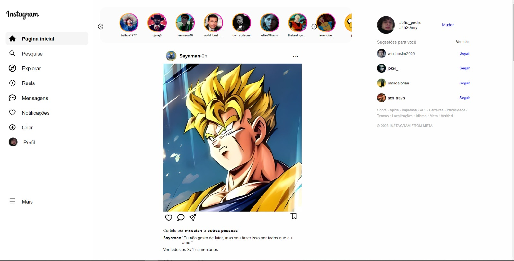

<h1> Clone Instagram</h1>
Bem-vindo ao meu projeto de um Clone do Instagram, onde os usuários são personagens que gosto e seus momentos mais emocionantes.

 
  

O intuito foi ser o mais proximo possivel do instagram visualmente falando, sem as funcionalidades dele, porém, para colocar meus conhecimentos em prática 
criei um carrosel nos stories .O projeto foi  desenvolvido com React.js atraves de conhecimentos adquiridos no PROA. 

##  Como acessar o projeto ?

  

Você pode simplesmente acessar esse link https://clone-instagram-cyan.vercel.app/ ou baixar o projeto e executa-lo em sua máquina. 

